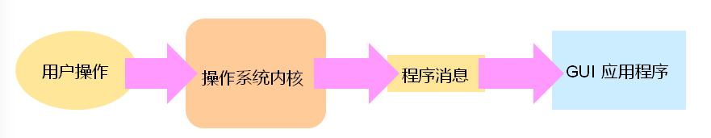
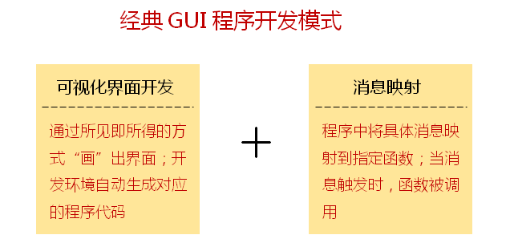
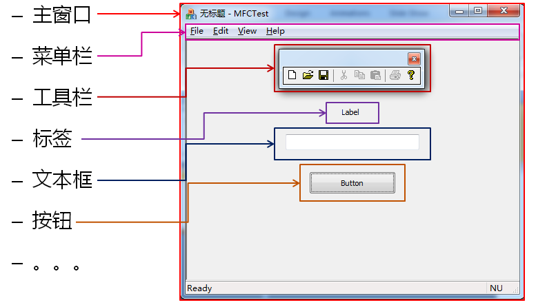
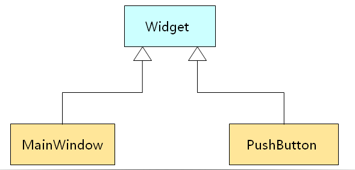

 # QT实验分析教程

## 第一课：GUI程序原理分析

- 命令行应用程序的特点（command line interface）
  - 是一种基于顺序执行结构的可执行程序
  - 程序执行过程中不需要与用户产生交互
  - 程序执行后给出最终的运行结果
- 
- 命令行应用程序的运行模式
  - 有固定的开始和固定的结束
- 命令行应用程序适用于
  - 单任务场合
  - 无交互或者简单交互场合
  - 服务器应用场合
- 命令行应用程序是早期计算机系统中的主要程序类型
- 图形界面应用程序
  - 随着计算机技术的发展，计算机走进日常生活
  - 计算机程序需要处理各个领域中的问题
  - 计算机用户不在时专业的计算机工作者
- 问题：如何让计算机更好的使用普通用户工作者？
- 图形界面应用程序的特点（Graphic User Interface）
  - 是一种基于消息驱动模型的可执行程序
  - 程序的执行依赖于用户的交互过程
  - 程序执行过程中实时相应用户操作
  - 一般情况下程序执行后不会主动退出
- 图形界面应用程序的运行模式
- 
- 图形界面应用程序的消息处理模型
- 
- 图形界面应用程序适用于
  - 多人物场合
  - 强用户交互的场合
  - 非专业计算机用户
- 图形界面应用程序是当代计算机系统中的主要程序类型
- 

- 小结

- | 命令行应用程序   | 图形界面应用程序 |
  | ---------------- | ---------------- |
  | 基于顺序执行结构 | 基于消息驱动模型 |
  | 弱交互执行       | 强交互执行       |
  | 由用户触发运行   | 由用户触发运行   |
  | 主动结束         | 由用户触发结束   |


## 第二课：GUI程序实例分析

-  现代操作系统支持GUI界面
  - 现代操作系统提供原声SDK支持GUI程序开发
  - GUI程序开发是现代操作系统上的主流技术
  - 不同操作系统上的GUI开发原理相同
  - 不同操作系统上的GUI SDK 不同
- GUI程序开发原理
  - GUI程序在运行时会创建一个消息队列
  - 系统内核将用户操作翻译成对应的程序消息
  - 程序在运行过程中需要实时处理队列中的消息
  - 当队列中没有消息时，程序将处于停滞状态



- 不同操作系统支持相同的GUI开发原理

- ```cpp
  //一个GUI开发的伪代码
  int main()
  {
      fd = DefineMainWindow();	//定义主窗口
      win = CreateMainWindow(fd);	//创建主窗口
      CreateElements(win);	//创建主窗口中的元素
      DisplayMainWindow(win);	//显示主窗口
      while( GetMessage(&msg))	//进入消息循环
      {
          //send msg to win	
      }
      
      return 0;
  }
  ```

- GUI程序开发：

  - 在代码中程序创建窗口以及窗口元素
  - 在消息处理函数中根据程序消息做出不同响应

- 

- 多数操作系统以C函数的方式提供GUI SDK

- 以windows操作系统为例：

- | 函数名           | 功能                     |
  | ---------------- | ------------------------ |
  | RegisterClass    | 想系统注册GUI窗口式样    |
  | CreatWindow      | 创建窗口或窗口元素       |
  | ShowWindow       | 在屏幕上显示创建好的窗口 |
  | UpdateWindow     | 刷新屏幕上的窗口         |
  | GetMessage       | 获取程序消息队列中的消息 |
  | TranslateMessage | 翻译系统消息             |
  | DispatchMessage  | 将消息发送到窗口处理函数 |

- 编程实验一：GUI程序开发初体验GUIDemo.sln

- 小结：

  - 现代操作系统提供原生SDK支持GUI程序开发
  - 不同操作系统上的GUI SDK不同
  - 不同操作系统上的GUI 开发原理相同
  - GUI程序开发包括
    - 在代码中用程序创建窗口以及窗口元素
    - 在消息处理函数中根据程序消息做出不同响应

## 第三课：QT的诞生和本质

- GUI用户界面元素
- GUI用户界面是由固定的窗口元素所构成的
- 

- 操作系统提供了创建用户界面元素所需要的函数
- 各种功能不同的函数依次调用，从而创建出界面元素
- 操作系统提供的原生函数无法直接映射到界面元素中
- 问题：如何直观地将界面元素的概念直接映射到程序中？
- 面向对象的GUI 程序设计
  - GUI应用程序是为了解决非科学计算问题而诞生的
  - GUI应用程序是用语非专业的日常生活领域
  - 面向过程程序设计方法不适合GUI程序设计
  - 面向对象程序设计方法更适合GUI程序设计
- 另一种眼界：
  - 用面向对象方法学看待GUI界面元素
  - 所有的界面元素都可以看作实际的对象
  - GUI用户界面是又各不相同的对象组成的
    - 主窗口对象
      - 菜单对象
      - 按钮对象
      - 文本框对象
      - 。。。
- 用面向对象的思想开发GUI应用程序
  - 程序中需要几个对话框？
  - 主界面上有哪些界面元素？
  - 需要的界面元素都对应哪些类？
  - 这些类都已经支持了吗？还是需要另外开发？
- GUI开发非常适合采用面向对象的方法学
  - 将界面元素定义为对应的类
  - 通过抽象和封装可以隐藏界面元素的细节
  - 程序的创建过程就是组合不同界面元素对象的过程
  - 

- 编程实验一：
  - 与gui 和ui 无关的功能全部抽象到application类中
  - widget统一了所有用户界面元素的功能
    - 每个用户界面元素都有一个从属关系widget* parent

  - Mainwindow 类继承自widget
    - 包含了主窗口的定义函数
    - 主窗口的创建函数
    - 主窗口的消息处理函数

- QT的本质：
  - QT是利用面向对象方法学开发的一套GUI组建库
  - QT就爱嗯不同操作系统的GUI细节封装于类的内部
  - QT提供一套跨平台的类用语开发GUI程序
  - QT遵循经典的GUI应用程序开发模式
- 小结
  - GUI程序开发更适合采用面向对象方法学
  - 所有界面元素都可以看成实际的对象
  - GUI用户界面是由各不相同的对象组成的
  - QT是利用面向对象方法学开发的一套GUI组建库
  - QT将GUI细节封装于累得内部，具有跨平台的特性

## 第四课：Hello QT

- QT是什么？

  - QT是一套跨平台的GUI开发库
  - QT是一套C++集成开发环境
  - QT是一套开源的殿堂级架构技术教程

- 第一个QT程序

- ```cpp
  #include <QApplication>
  #include <QMainWindow>
  #include <QPushButton>
  
  int main(int argc, char* argv[])
  {
      QApplictaion a(argc, argv);
      QMainWindow w;
      QPushButton b(&w);
      
      b.setText("Hello QT!");
      w.show();
      return a.exec();
  }
  ```

- QT开发环境

  - 启动QT命令行

  - 进入源程序所在目录

  - 命令

  - ```sh
    $ qmake -project	#根据目录中的源码省城工程文件
    $ qmake				#根据工程文件省城makefile文件
    $ make				#使用makefile编译
    ```

- 编程实验一：编译和运行第一个QT程序 

- 1

- QT creator 是一套可视化的集成开发环境

  - 使用QT creator 可以高效地进行QT开发
  - QT creator 提供了强大的代码编辑功能
  - QT creator 提供了强大的调试功能

- 调试的基本方法

  - Log调试法
    - 在代码中加入一定的打印语句
    - 打印程序状态和关键变量的值
  - 断电调试法
    - 在开发环境中的对应代码行加上断电
    - 当程序运行到断点行时，程序暂停运行
    - 需要时可加上条件断点，当条件满足才暂停程序的运行

- 编程实验二：QT creator 使用初体验

- 小结：

  - QT是一套跨平台的C++界面开发库
  - 可以通过命令行的方式开发QT应用程序
  - 也可以通过QT creator进行QT 开发
  - QT creator 同时支持Log调试法和断点调试法

## 第五课：QT creator 工程介绍

- QT creator 以工程项目的方式对源码进行管理
- 一个QT creator 工程包含不同类型的文件
  - `.pro` 项目描述文件
  - `.pro.user` 用户配置描述文件
  - `.h` 头文件
  - `.cpp` 源文件
  - `.ui` 界面描述文件
  - 资源文件（图片，音频等）
- `.pro`项目文件的基本构成
  - \# ： 注释起始符号
  - QT：模块声明
  - TARGET：可执行文件名
  - TEMPLATE：程序模板声明
  - SOURCES：源码文件声明
  - HEADERS：头文件声明
  - FORMS：界面文件声明
  - RC_FILE：资源文件声明
