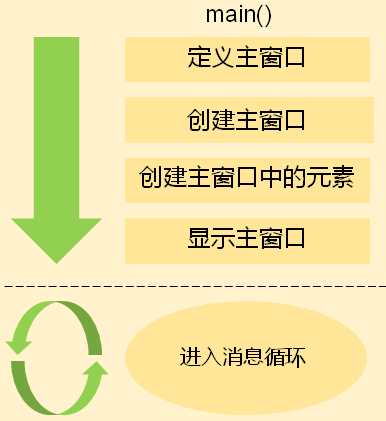
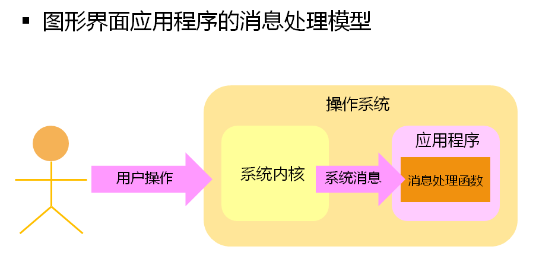
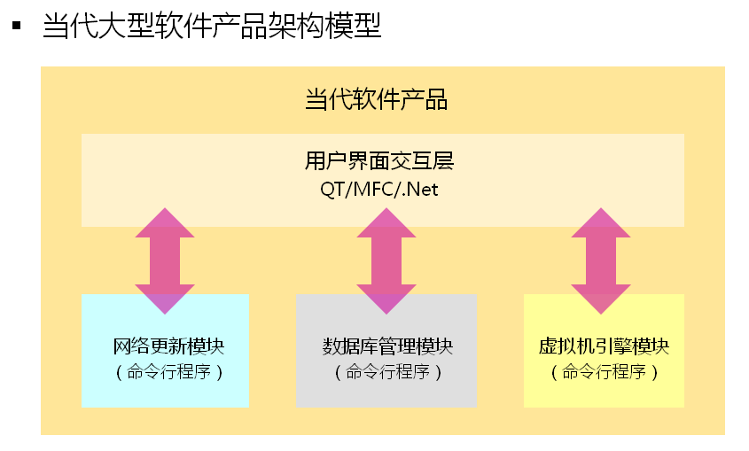

 # QT实验分析教程

## 第一课：GUI程序原理分析

- 命令行应用程序的特点（command line interface）
  - 是一种基于顺序执行结构的可执行程序
  - 程序执行过程中不需要与用户产生交互
  - 程序执行后给出最终的运行结果
- 
- 命令行应用程序的运行模式
  - 有固定的开始和固定的结束
- 命令行应用程序适用于
  - 单任务场合
  - 无交互或者简单交互场合
  - 服务器应用场合
- 命令行应用程序是早期计算机系统中的主要程序类型
- 图形界面应用程序
  - 随着计算机技术的发展，计算机走进日常生活
  - 计算机程序需要处理各个领域中的问题
  - 计算机用户不在时专业的计算机工作者
- 问题：如何让计算机更好的使用普通用户工作者？
- 图形界面应用程序的特点（Graphic User Interface）
  - 是一种基于消息驱动模型的可执行程序
  - 程序的执行依赖于用户的交互过程
  - 程序执行过程中实时相应用户操作
  - 一般情况下程序执行后不会主动退出
- 图形界面应用程序的运行模式
- 
- 图形界面应用程序的消息处理模型
- 
- 图形界面应用程序适用于
  - 多人物场合
  - 强用户交互的场合
  - 非专业计算机用户
- 图形界面应用程序是当代计算机系统中的主要程序类型
- 

- 小结

- | 命令行应用程序   | 图形界面应用程序 |
  | ---------------- | ---------------- |
  | 基于顺序执行结构 | 基于消息驱动模型 |
  | 弱交互执行       | 强交互执行       |
  | 由用户触发运行   | 由用户触发运行   |
  | 主动结束         | 由用户触发结束   |

## 第二课：GUI程序实例分析

